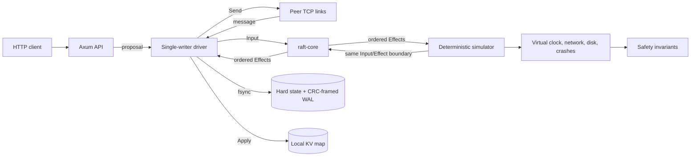

# micro-raft

[](https://github.com/pes1ug23am910/micro-raft/actions/workflows/ci.yml)

A compact, fixed-membership Raft implementation in Rust: an I/O-free consensus
core, a deterministic fault-injection simulator, and a durable three-node
key-value service over TCP and HTTP.

The project is deliberately small enough to audit end to end. It implements
leader election, log replication and conflict repair, current-term-safe commit
advancement, crash recovery, persist-before-send ordering, and local KV reads.
It is a systems demonstration, not a production database.

## Architecture



| Crate | Responsibility |
|---|---|
| `raft-core` | Pure deterministic state machine. Inputs enter through `step`; ordered persistence, network, apply, and client effects come out. Its only external dependency is `serde`. |
| `kv-node` | Recovery, synchronous durable writes, bounded Tokio/TCP transport, applied KV state, client completion, and the HTTP API. |
| `sim` | Seeded virtual time, loss, delay, partitions, crash/restart, virtual disks, and safety checks after each transition. |

## Correctness and durability

- A new term, granted vote, or accepted log suffix is persisted before a
  dependent message can leave the node.
- `current_term`, `voted_for`, and the log survive restart; volatile commit and
  apply positions are relearned from the leader.
- Hard state uses a write-sync-rename swap. Log entries use CRC32-framed JSONL,
  `sync_all`, contiguous-index validation, unterminated-tail recovery, and
  fail-closed handling for every newline-terminated corrupt frame.
- Leaders commit only entries from their current term by replica count. Older
  entries become committed through a later current-term entry.
- Catch-up is bounded to 16 entries per `AppendEntries` RPC. With 1 KiB keys
  and 64 KiB values, a worst-case JSON-escaping regression keeps the complete
  frame below the 8 MiB protocol limit.
- Inbound and outbound queues are bounded. Saturated outbound links drop
  messages; later heartbeats retry replication, while later election rounds
  retry election traffic.

The project-local rule labels used in source comments and tests are defined in
[the R1-R20 rule index](docs/raft-rules.md), with their Raft paper provenance
and implementation entry points.

## HTTP API

Each node binds its client API to `127.0.0.1`.

| Request | Result |
|---|---|
| `PUT /kv/{key}` with a raw text body | `200 {"ok":true,"index":N}` after the entry is applied |
| `DELETE /kv/{key}` | `200 {"ok":true,"index":N}` after apply |
| Write sent to a non-leader | `503 {"error":"not_leader","leader_hint":ID}`; the hint is `null` if no leader is known |
| Write cannot be enqueued within 2 seconds | `503 {"error":"timeout"}` |
| Write path closes before enqueue | `503 {"error":"unavailable"}` |
| Enqueued write is not confirmed applied by the 2-second deadline, or loses completion | `503 {"error":"outcome_unknown","leader_hint":ID}`; the hint may be `null` |
| `GET /kv/{key}` | Local `200` value or `404`, with `X-Raft-Role` and `X-Raft-Last-Applied` |
| `GET /status` | Node id, role, term, commit index, apply index, and leader hint |

Keys are limited to 1 KiB after path decoding; values are limited to 64 KiB.
The API's `timeout` response means the request was not enqueued. After enqueue,
an `outcome_unknown` response or lost connection is genuinely ambiguous: the
driver may skip an expired queued request, or the proposal may already have
been accepted and may still commit. There are no request ids or session
deduplication, so a blind retry cannot establish whether the first attempt took
effect.

## Run the failure demo

Requirements: Windows PowerShell 5.1 or newer, `curl.exe`, and `rustup`. The
included toolchain file selects and installs Rust 1.96.0.

```powershell
powershell.exe -NoProfile -ExecutionPolicy Bypass -File .\scripts\demo.ps1
```

The script builds a release binary, starts three isolated nodes, commits three
values, kills the leader, waits for a replacement, verifies the old data,
commits another value, restarts the old leader with its existing disk, and
waits for it to catch up. Node logs and the transcript stay under ignored
`.local/demo/` directories.

The latest verification run detected a replacement leader **0.264 seconds**
after the old leader exited and passed the old-leader restart/catch-up sequence.

## Verification

```powershell
cargo fmt --all -- --check
cargo check --workspace --all-targets --all-features --locked
cargo clippy --workspace --all-targets --all-features --locked -- -D warnings
cargo test --workspace --all-targets --all-features --locked
cargo test --workspace --all-targets --all-features --release --locked
cargo test -p sim --release --test chaos soak_extended -- --ignored --exact
```

Replay one deterministic chaos seed (decimal `u64`) with:

```powershell
$env:MICRO_RAFT_SEED = "137"
cargo test -p sim --release --test chaos soak_200_seeds_all_invariants -- --exact --nocapture
Remove-Item Env:MICRO_RAFT_SEED
```

The GitHub Actions workflow runs the full debug and release suites on Windows.
Other operating systems are not part of the automated CI matrix.

The release candidate has **78 passing tests** plus the explicitly invoked
extended soak. Coverage includes:

- election safety, term monotonicity, log matching, state-machine safety, and
  committed-entry durability/leader completeness;
- duplicate vote replies, stale messages, split votes, deep divergent-log
  repair, and the prior-term Figure 8 commit case;
- persist-before-observe auditing and a negligent-persistence negative control
  that demonstrates the double-vote failure after restart;
- real storage replacement failures, final-frame tears, interior corruption,
  TCP framing, queue saturation, HTTP limits, leader loss, and disk restart;
- a 200-seed suite with 60,000 virtual milliseconds per seed under message
  loss, variable delay, partitions, and minority crash/restart schedules;
- a pre-release 1,000-seed extended soak, completed in **211.47 seconds**.

The 200-seed release test completed in **43.91 seconds** on the measurement
machine. Chaos-schedule and invariant assertion failures include the seed so
the failing schedule can be replayed.

## Benchmark

Run the benchmark against a fresh isolated cluster:

```powershell
powershell.exe -NoProfile -ExecutionPolicy Bypass -File .\scripts\bench.ps1
```

The default run performs two 30-second sequential trials and two 30-second
trials with eight clients. Every client keeps one request outstanding, every
accepted log append is synced, latencies are end to end, and percentiles use
nearest rank. A trial with any failed write is rejected. Raw results remain in
ignored `.local/benchmarks/` directories. The summary records the source
revision and tracked-worktree state when Git can read and trusts the checkout;
those optional fields are `null` for an archive, an unavailable Git executable,
or a checkout rejected by Git's ownership checks.

Measured on Windows x64 build 26200 with Rust 1.96.0 and the release profile.
This was a single-machine loopback run on 2026-09-25 from clean source revision
`32ed26c`, using unique keys and small `value-<sequence>` text payloads. All
four trials shared one freshly started cluster; the figures characterize this
local demonstration, not a distributed-network deployment.

| Trial | Clients | Writes/s | p50 | p99 | Successful writes | Failures |
|---|---:|---:|---:|---:|---:|---:|
| Sequential 1 | 1 | 16.13 | 61.075 ms | 65.052 ms | 484 | 0 |
| Sequential 2 | 1 | 16.14 | 61.318 ms | 63.457 ms | 485 | 0 |
| Concurrent 1 | 8 | 128.85 | 61.296 ms | 64.681 ms | 3,872 | 0 |
| Concurrent 2 | 8 | 128.84 | 61.447 ms | 64.970 ms | 3,869 | 0 |

Replication intentionally rides the 50 ms heartbeat cadence. A single client
therefore waits roughly one heartbeat per write, while multiple outstanding
clients fill the same replication windows. Each accepted proposal still has
its own durable append; group commit is not implemented.

## Scope and limitations

- Membership is fixed at three nodes. There is no joint consensus or dynamic
  reconfiguration.
- Peer transport is trusted-localhost only. Frames have no authentication or
  encryption and trust the claimed sender id; Byzantine behavior is out of
  scope.
- No read is linearizable, including a read from a node that currently reports
  itself as leader. Reads use only that node's local applied state; followers,
  partitioned former leaders, and newly elected leaders may all return stale
  data because there is no ReadIndex, quorum confirmation, or read lease.
- An `outcome_unknown` response or connection loss after enqueue may mean the
  driver skipped the expired request, or that an accepted entry can still
  commit. There are no request ids, sessions, or retry deduplication.
- Elections do not implement PreVote or CheckQuorum. A partitioned leader does
  not step down merely because it has lost contact with a majority.
- Conflict repair decrements `next_index` using the follower's last-index hint;
  it does not implement the optional conflict-term fast-backtracking extension.
- The complete log remains in memory and on disk. There are no snapshots or
  compaction, recovery reads the WAL into memory, and conflict repair rewrites
  the retained prefix.
- File contents are synced before acknowledgment, but parent directories are
  not fsynced. The project does not claim durability across hardware that lies
  about flushes or every sudden-power-loss edge case.
- Peer listeners have bounded message queues but no authentication, connection
  quota, or per-connection read deadline. Keep the service on trusted loopback.

## Repository layout

```text
crates/raft-core/   consensus state machine
crates/kv-node/     durable node, transport, storage, and HTTP API
crates/sim/         deterministic simulator and fault suites
docs/raft-rules.md  rule-to-paper and rule-to-code traceability
scripts/demo.ps1    leader-failure and restart demonstration
scripts/bench.ps1   reproducible write benchmark
```

## License

MIT — see [LICENSE](LICENSE).
