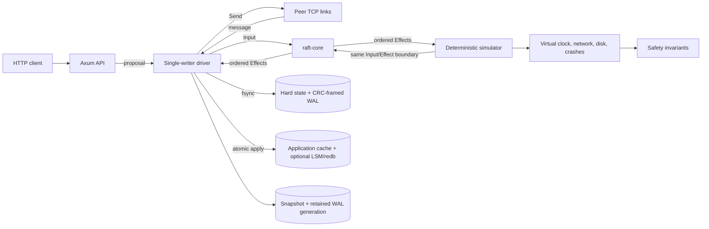

# micro-raft

[](https://github.com/pes1ug23am910/micro-raft/actions/workflows/ci.yml)

A Raft-based key-value system in Rust: an I/O-free consensus core, deterministic
fault simulation, durable storage, replica reconfiguration, and state handoff
between independently replicated shard groups.

The same deterministic core runs in the simulator and the real networked
services. Together, the core and service layers implement election and log
repair, crash recovery,
persist-before-send ordering, replicated retry sessions, PreVote/CheckQuorum,
ReadIndex, chunked snapshots, WAL group commit, optional LSM/redb application
storage, joint-consensus membership and a replicated shard controller.

Start with the [failure demo](#run-the-failure-demo),
[membership walkthrough](docs/membership.md), or
[three-process shard example](docs/sharding.md). The
[architecture guide](docs/architecture.md) explains the safety boundaries and
tradeoffs. This is an experimental systems project for trusted networks.

## Architecture


```mermaid
flowchart LR
    Client[HTTP client] --> API[Axum API]
    API -->|proposal| Driver[Single-writer driver]
    Peer[Peer TCP links] -->|message| Driver
    Driver -->|Input| Core[raft-core]
    Core -->|ordered Effects| Driver
    Driver -->|fsync| Disk[(Hard state + CRC-framed WAL)]
    Driver -->|Send| Peer
    Driver -->|atomic apply| State[(Application cache + optional LSM/redb)]
    Driver --> Snapshot[(Snapshot + retained WAL generation)]

    Sim[Deterministic simulator] -->|same Input/Effect boundary| Core
    Core -->|ordered Effects| Sim
    Sim --> Virtual[Virtual clock, network, disk, crashes]
    Virtual --> Checks[Safety invariants]
```

| Crate | Responsibility |
|---|---|
| `raft-core` | Pure deterministic state machine. Inputs enter through `step`; ordered persistence, network, apply, and client effects come out. Its only runtime dependency is `serde`; tests also use `serde_json`. |
| `kv-node` | Recovery, synchronous durable writes, bounded Tokio/TCP transport, applied KV state, client completion, and the HTTP API. |
| `sim` | Seeded virtual time, loss, delay, partitions, crash/restart, virtual disks, and safety checks after each transition. |
| `state-store` | Bounded LSM with checksummed WAL/SSTables, Bloom filters, leveled compaction and manifest recovery; a matched redb adapter and benchmark worker. |
| `shard-service` | Controller and data-group actors, checked epoch routing, fenced pull/install handoff, preserved retry receipts, and recoverable abort/cleanup. |

The [architecture guide](docs/architecture.md) explains the persistence,
commitment, read and recovery invariants and their counterexamples.

## Correctness and durability

- A new term, granted vote, or accepted log suffix is persisted before a
  dependent message can leave the node.
- Term, vote, snapshot and retained log survive restart. Snapshot boundaries
  and validated engine watermarks restore already-applied state. Durable
  committed membership records also preserve a committed-prefix floor;
  remaining ordinary commitment is relearned through consensus.
- Hard state uses a write-sync-rename swap. Log entries use CRC32-framed JSONL,
  `sync_all`, contiguous-index validation, unterminated-tail recovery, and
  fail-closed handling for every newline-terminated corrupt frame. Snapshot
  publication durably selects a snapshot/WAL pair before reclaiming old files.
- Leaders commit only entries from their current term by replica count. Older
  entries become committed through a later current-term entry.
- Catch-up is bounded to 16 entries per `AppendEntries` RPC. With 1 KiB keys
  and 64 KiB values, a worst-case JSON-escaping regression keeps the complete
  frame below the 8 MiB protocol limit.
- Inbound and outbound queues are bounded. Saturated outbound links drop
  messages; later heartbeats retry replication, while later election rounds
  retry election traffic.

The project-local rule labels used in source comments and tests are defined in
[the R1-R20 rule index](docs/raft-rules.md), with their Raft paper provenance
and implementation entry points.

## Node configuration

The following flags and HTTP endpoints belong to `kv-node`; `shard-service`
uses a topology file and its intent API described in the shard walkthrough.

Choose one complete address configuration. Legacy same-host invocations use
both `--raft-port` and `--http-port` and bind IPv4 loopback. Explicit network
configuration requires all four flags below and rejects either legacy port
flag; omitted fields do not fall back to loopback.

| Flag | Meaning | Container example |
|---|---|---|
| `--raft-listen` | Local numeric IP and port for peer TCP | `0.0.0.0:7100` |
| `--raft-advertise` | Intended reachable peer endpoint | `node1:7100` |
| `--http-listen` | Local numeric IP and port for HTTP | `0.0.0.0:8100` |
| `--http-advertise` | Intended reachable HTTP endpoint | `node1:8100` |

Listen endpoints accept numeric IPv4 or bracketed IPv6, including wildcard
binds. Peer entries retain the `id@host:port` format; peers and advertisements
accept ASCII DNS names, numeric IPv4, or bracketed IPv6. IPv6 scope IDs are
unsupported. Ports must be nonzero.
Wildcards are bind addresses, never destinations. Multicast, IPv4 limited
broadcast, known self-peer aliases, duplicate peer IDs, and duplicate resolved
peer sockets are rejected. Every DNS result is checked; IPv4-mapped IPv6
addresses are canonicalized to IPv4 so textual aliases cannot bypass checks.
Explicit configuration rejects loopback destinations. Legacy configuration
keeps distinct loopback peers usable, including safe hostname aliases.

Legacy groups and `--check-config` require complete endpoint validation before
opening storage or listeners. Transient lookup failures are retried within a
shared five-second budget; each lookup is limited to two seconds.

Named-group membership is independent of address mode; local named groups may
use the legacy loopback port flags. An explicit `--group-id` with matching
`--genesis-voters` recovers durable group
authority first. Its local advertisements must validate, but unavailable active
peer routes remain visible in status and retry in the background. Retired seed
names do not prevent reopening. Partial connectivity grants no quorum authority.
See [membership bootstrap and routing](docs/membership.md).

Before a peer reconnect, its endpoint and this node's advertisements are
resolved again and checked against other peers' accepted cached addresses.
Normal reconnects do not depend on unrelated peers' DNS. A conflict with a
cached address triggers one complete resolution and an atomic compare-and-swap
of the accepted snapshot, allowing peers to exchange addresses without a
permanent cache collision. A concurrent cache change rejects that attempt;
invalid or unavailable results never silently fall back to an obsolete address.
Ordinary DNS changes take effect on reconnect. A replicated membership route
change cancels removed or repointed links and preserves unchanged connections.

DNS waits are bounded to two seconds per lookup and five seconds per snapshot,
with at most sixteen candidates per endpoint. A reconnect's conflict fallback
can add another five seconds. At most four OS DNS workers run per process;
only one OS lookup per normalized hostname may remain outstanding. Another
caller for that name fails promptly while the first lookup is in progress. Caller
timeouts cannot cancel OS lookup work, so blocked distinct names can still
occupy all four slots until those calls return.

Resolution checks address validity, not remote availability. Advertisements
do not create service discovery, change membership, or add HTTP redirects:
clients still need an explicit mapping from node identity to HTTP endpoint.

Use `--check-config` with the normal required flags to validate and print the
resolved configuration without opening storage or listeners. For example:

```powershell
cargo run -p kv-node --bin kv-node --locked -- --id 1 --peers '2@127.0.0.1:7102,3@127.0.0.1:7103' --data-dir .local/node1 --raft-port 7101 --http-port 8101 --check-config
```

Successful output is diagnostic JSON with `schema_version: 1`, the node ID,
configuration mode, listen and advertised endpoints, resolved candidates, and
peer endpoints/candidates. Invalid flags or resolution fail before startup.
The diagnostic does not contact peers or establish quorum/reachability.
See [the address decision](docs/adr/0001-listen-vs-advertise.md) for the resolver
and reconnect tradeoffs.

## HTTP API

Legacy configuration binds the client API to `127.0.0.1`; explicit
configuration uses `--http-listen`.

| Request | Result |
|---|---|
| `PUT /kv/{key}` with a raw text body | `200 {"ok":true,"index":N}` after the entry is applied |
| `DELETE /kv/{key}` | `200 {"ok":true,"index":N}` after apply |
| Write sent to a non-leader | `503 {"error":"not_leader","leader_hint":ID}`; the hint is `null` if no leader is known |
| Write cannot be enqueued within 2 seconds | `503 {"error":"timeout"}` |
| Write path closes before enqueue | `503 {"error":"unavailable"}` |
| Shutdown rejects a new or queued, unaccepted write | `503 {"error":"shutting_down"}` |
| Enqueued write is not confirmed applied by the 2-second deadline, or loses completion | `503 {"error":"outcome_unknown","leader_hint":ID}`; the hint may be `null` |
| `GET /kv/{key}` | Local `200` value or `404`, with `X-Raft-Role`, `X-Raft-Last-Applied`, and `X-Raft-Read-Mode: local` |
| `GET /kv/{key}?consistency=linearizable` | Leader-only quorum-confirmed `200` value or `404`, after the confirmed index is applied; otherwise `503` |
| `POST /sessions` with a registration nonce | Replicated registration returning a retained session ID |
| `PUT /sessions/{id}/kv/{key}?sequence=N` | Retry-protected mutation with the same original response for an identical latest retry |
| `DELETE /sessions/{id}/kv/{key}?sequence=N` | Retry-protected deletion |
| `DELETE /sessions/{id}` | Replicated, idempotent close; the ID cannot reopen |
| `GET /status` | Role/term, commit/apply/snapshot positions, effective and committed membership, and route errors |
| `POST /admin/membership` | Explicit-group learner admission, voter-set change or removal; retained request ID resolves unknown outcomes |
| `GET /admin/membership/{request_id}` | Locally known committed administrative result, explicitly marked as a local observation |

Keys are limited to 1 KiB after path decoding; values are limited to 64 KiB.
The API's `timeout` response means the request was not enqueued;
`shutting_down` means the proposal was not accepted by Raft. After enqueue,
an `outcome_unknown` response or lost connection is genuinely ambiguous: the
driver may skip an expired queued request, or the proposal may already have
been accepted and may still commit. Legacy `/kv` mutations are unprotected.
Use the session endpoints when a retry must preserve the original operation
identity; retain the same session, key, sequence and payload after an unknown
outcome. Sessions are bounded and retained until database reset; they never
expire or evict silently. See [client sessions and reads](docs/client-semantics.md)
for sequencing, limits, response metadata and failure behavior.

## Shutdown

On Unix, SIGTERM and SIGINT request a coordinated shutdown; Windows uses
Ctrl-C and Ctrl-Break. The first request closes HTTP write admission and the
Raft listening socket. Already accepted peer streams remain available while
the single writer drains accepted proposals. Queued proposals that have not
entered Raft receive `shutting_down`; an accepted proposal without a confirmed
completion remains an unknown outcome.

The writer finishes each started persistence/effect batch in order, waits up
to five seconds from the first request for asynchronous/quorum progress, and
performs a required final file sync. Persistence or final-sync failure makes
the process exit unsuccessfully. The five-second limit does not interrupt a
blocked filesystem syscall or establish an fsync deadline. After the writer
finishes, peer and HTTP cleanup share a further 250-millisecond budget before
remaining server tasks are aborted and the binary tears down its runtime.
This is not a guaranteed 5.25-second process-exit bound.

SIGKILL bypasses this path and exercises crash recovery. File content and
parent-directory barriers are implemented on Windows and Linux. Process
crash tests do not prove survival through every physical power-loss case.

## Snapshots, batches and applied-state storage

- `--snapshot-threshold 256` captures values, sessions and configuration
  metadata at an applied boundary; lagging followers receive 64 KiB chunks.
  Zero disables automatic capture. See [snapshots and recovery](docs/snapshots.md).
- `--batch-records 16 --batch-delay-ms 2` bounds proposal collection before
  one WAL append barrier. Each request retains its own result and index.
  See [batching and fairness](docs/proposal-batching.md).
- `--state-backend memory|lsm|redb` selects the derived application store.
  Persistent modes atomically commit values, retry state and applied
  watermark before publishing responses. Choose the backend for a fresh
  data directory. See [applied-state durability and recovery](docs/applied-state.md).

All modes serve reads from a complete in-memory application cache. The LSM
engine comparison measures the engine worker, not replicated HTTP reads.

## Run the failure demo

Requirements: Windows PowerShell 5.1 or newer, `curl.exe`, and `rustup`. The
included toolchain file selects and installs Rust 1.96.0.

```powershell
powershell.exe -NoProfile -ExecutionPolicy Bypass -File .\scripts\demo.ps1
```

The script builds a release binary, starts three isolated nodes, commits three
values, kills the leader, waits for a replacement, verifies the old data,
commits another value, restarts the old leader with its existing disk, and
waits for it to catch up. Node logs and the transcript stay under ignored
`.local/demo/` directories.

## Verification

```powershell
cargo fmt --all -- --check
cargo check --workspace --all-targets --all-features --locked
cargo clippy --workspace --all-targets --all-features --locked -- -D warnings
cargo test --workspace --all-targets --all-features --locked
cargo test --workspace --all-targets --all-features --release --locked
cargo test -p sim --release --test chaos soak_extended -- --ignored --exact
```

Replay one deterministic chaos seed (decimal `u64`) with:

```powershell
$env:MICRO_RAFT_SEED = "137"
cargo test -p sim --release --test chaos soak_200_seeds_all_invariants -- --exact --nocapture
Remove-Item Env:MICRO_RAFT_SEED
```

The GitHub Actions workflow runs Windows and Linux formatting, lint and
debug/release tests, Python observer checks, and a Linux container smoke. It
retains failed process fixtures and container evidence as artifacts. The badge
links to the current hosted result; a workflow file alone is not passing
evidence.

The test suites cover:

- election safety, term monotonicity, log matching, state-machine safety, and
  committed-entry durability/leader completeness;
- duplicate vote replies, stale messages, split votes, deep divergent-log
  repair, and the prior-term Figure 8 commit case;
- persist-before-observe auditing and a negligent-persistence negative control
  that demonstrates the double-vote failure after restart;
- real storage replacement failures, final-frame tears, interior corruption,
  TCP framing, queue saturation, HTTP limits, leader loss, and disk restart;
- injected DNS changes, forbidden aliases, concurrent cache refreshes, real
  IPv4/IPv6 connections, idle disconnects, write progress and task cleanup;
- shutdown admission, accepted-write draining, persistence-failure propagation,
  and Linux process signal/restart behavior;
- checked-read contexts and application fences, bounded session retries,
  snapshot publication/install gaps, and LSM/redb all-process recovery;
- real TCP-gated joint old-only/new-only partitions and final-configuration
  recovery after every original voter is stopped;
- controller/source/destination handoff interruptions, migrated deletion and
  retry state, and replica-membership interaction within shard actors;
- a 200-seed suite with 60,000 virtual milliseconds per seed under message
  loss, variable delay, partitions, and minority crash/restart schedules. An
  additional 1,000-seed soak is explicitly invoked with the command above.

Chaos-schedule and invariant assertion failures include the seed so the
failing schedule can be replayed. Python client and harness unit tests run on
Linux or WSL without starting containers:

```bash
python3 -B -X utf8 -m unittest discover -s deploy/docker/client -p 'test_client.py' -v
python3 -B -X utf8 -m unittest discover -s scripts -p 'test_*.py' -v
```

## Measurements

The [paired batching experiment](docs/benchmarks/proposal-batching-2026-10-01.md)
observed fewer WAL append syncs but essentially unchanged throughput and
latency. The [LSM/redb comparison](docs/benchmarks/state-store-2026-10-01.md)
retains both the initial compaction regression and corrected measurements,
including write-byte amplification, Bloom probes and compaction latency.
The [placement experiment](docs/benchmarks/shard-placement-2026-10-01.md)
compares modulo and Ketama assignment, including cases with worse load balance.
Each report identifies its executable or script, workload, environment and limits.
Placement counts do not measure live handoff throughput; engine reads do not
measure the service's in-memory HTTP read path.

### Historical baseline

Run the benchmark against a fresh isolated cluster:

```powershell
powershell.exe -NoProfile -ExecutionPolicy Bypass -File .\scripts\bench.ps1
```

The default run performs two 30-second sequential trials and two 30-second
trials with eight clients. Every client keeps one request outstanding, every
accepted log append is synced, latencies are end to end, and percentiles use
nearest rank. A trial with any failed write is rejected. Raw results remain in
ignored `.local/benchmarks/` directories. The summary records the source
revision and tracked-worktree state when Git can read and trusts the checkout;
those optional fields are `null` for an archive, an unavailable Git executable,
or a checkout rejected by Git's ownership checks.

Measured on Windows x64 build 26200 with Rust 1.96.0 and the release profile.
This was a single-machine loopback run on 2026-09-25 from clean source revision
`c00c83c`, using unique keys and small `value-<sequence>` text payloads. All
four trials shared one freshly started cluster; the figures characterize this
local demonstration, not a distributed-network deployment.

| Trial | Clients | Writes/s | p50 | p99 | Successful writes | Failures |
|---|---:|---:|---:|---:|---:|---:|
| Sequential 1 | 1 | 16.10 | 61.287 ms | 65.988 ms | 484 | 0 |
| Sequential 2 | 1 | 16.20 | 61.240 ms | 65.646 ms | 486 | 0 |
| Concurrent 1 | 8 | 128.94 | 61.364 ms | 66.822 ms | 3,872 | 0 |
| Concurrent 2 | 8 | 128.75 | 61.381 ms | 67.696 ms | 3,864 | 0 |

That baseline used a separate durable append for every proposal and
replication on the 50 ms heartbeat cadence. It predates proposal batching,
snapshots and the additional state engines; these figures are retained as
historical measurements rather than results for the current implementation.

## Scope and limitations

- Joint consensus changes voters within an explicitly identified group.
  Learners catch up before promotion; retired IDs and administrative results are
  retained with finite bounds. Reachable endpoints alone never confer votes.
- Shard ownership and replica membership are distinct replicated operations.
  The moving shard is unavailable from source fencing until destination
  activation.
  The service has no cross-shard transactions or live resharding of the fixed
  key-to-shard function. See [shard operation and limits](docs/sharding.md).
- Peer transport requires a trusted network. Legacy configuration uses
  loopback; explicit configuration can expose listeners on a private network.
  Frames have no authentication or encryption and trust the claimed sender
  id; Byzantine behavior is out of scope.
- Default reads are local and can be stale on any node. Explicit
  `consistency=linearizable` reads require a committed current-term entry,
  fresh per-read confirmation from an effective-configuration quorum and an
  actual application fence; a joint configuration needs both majorities.
  They fail when this authority cannot be established; there is no time lease.
- An `outcome_unknown` response or connection loss after enqueue may mean the
  driver skipped the expired request, or that an accepted entry can still
  commit. Legacy mutations do not deduplicate retries; the session API does
  within its explicit retained, key-scoped sequence contract.
- PreVote avoids isolated-node term inflation, and CheckQuorum steps a leader
  down after losing fresh contact with an effective-configuration quorum.
  These mechanisms do not establish
  a read lease or promise a wall-clock election bound. All members must use
  the same upgraded wire protocol; mixed-version operation is unsupported.
- Conflict repair uses correlated term/first-index hints to skip divergent
  term runs, with last-index fallback for replies without the optional hint.
  Rejections cannot undo confirmed replication progress. See
  [conflict-term backtracking](docs/conflict-backtracking.md).
- Snapshot publication compacts a committed applied prefix. Retained log
  entries and the complete application cache remain in memory. Oversized snapshots
  are refused while the WAL is retained, so the snapshot threshold is not
  a total memory or disk quota. Conflict repair rewrites the retained prefix.
- Durable publication syncs file contents and directory entries on Linux and
  Windows, propagating errors. Filesystem-call and recovery tests do not prove
  survival on hardware that lies about flushes or every physical power-loss case.
- Peer listeners admit at most 16 simultaneous connection tasks; a new
  connection evicts the oldest at capacity. This is a trusted-small-cluster
  resource bound, not an authentication or denial-of-service defense. TCP
  keepalive uses 60 seconds idle and, on Linux/Windows, a 10-second interval
  with platform-default retry counts. There is no application read-idle
  timeout, because healthy follower links may legitimately be idle.
- Dialing is bounded to one second per candidate and five seconds per attempt,
  with rotating candidate order and 200-millisecond to two-second retry
  backoff. Writes fail after two seconds without progress; a continuously
  progressing frame can take longer. These limits do not bound election or
  recovery time.
- Legacy startup and `--check-config` require all configured endpoints to
  resolve; explicit groups support degraded active-peer routing with visible
  retry. Alias validation can still conservatively reject an address change.
  See [the address decision](docs/adr/0001-listen-vs-advertise.md).

## Repository layout

```text
crates/raft-core/   consensus state machine
crates/kv-node/     durable node, transport, storage, and HTTP API
crates/sim/         deterministic simulator and fault suites
crates/state-store/ LSM and redb adapters with an engine workload worker
crates/shard-service/ controller/data actors and recoverable state handoff
docs/raft-rules.md  rule-to-paper and rule-to-code traceability
scripts/demo.ps1    leader-failure and restart demonstration
scripts/bench.ps1   reproducible write benchmark
scripts/cluster_experiment.py  container smoke/fault oracle and evidence capture
deploy/docker/     three-node Compose setup and durable observation client
```

## License

MIT — see [LICENSE](LICENSE).

## Running in containers

Requirements: Linux or WSL, Bash, Python 3, and a running Docker engine with
Compose. The Compose setup runs three fixed members on an internal network
with explicit bind/advertise endpoints, DNS peers and persistent named
volumes. No host ports are published. The node runtime is slim Debian matching
the Rust builder; the client image uses Python. `/status` healthchecks show
HTTP liveness only. The configured container stop grace is 15 seconds.

Run one leader-kill/recovery smoke cycle or the larger fault matrix from the
repository root. Each invocation requires a fresh Compose project name and a
new or empty output directory; existing project containers, networks or
volumes are rejected before starting.

```bash
project="micro-raft-smoke-$(date +%s)"
bash scripts/compose_smoke.sh --compose deploy/docker/compose.3.yml --project "$project" --timeout-seconds 30 --out ".local/$project"

project="micro-raft-faults-$(date +%s)"
bash scripts/faults.sh --compose deploy/docker/compose.3.yml --project "$project" --fault all --runs 20 --timeout-seconds 30 --out ".local/$project"
```


By default the harness builds project-specific node and client images. To
repeat an experiment against existing local binaries, supply both
`--node-image IMAGE` and `--client-image IMAGE` to either script. Supplying only
one is an error. This mode skips the build, inspects both images before creating
resources, records their immutable IDs in `image-selection.json`, and uses
those IDs without pulling images. The observed node and observer container
image IDs must match. Mutable tags can identify the initial selection, but a
tag change after inspection cannot silently change the binaries under test.
A fresh project and empty output directory are still required.

Docker Desktop users can run the Linux harness in a dedicated runner container
without enabling WSL integration. From the repository root in PowerShell:

```powershell
docker build -t micro-raft-experiment-runner -f deploy/docker/runner/Dockerfile deploy/docker/runner
$project = "micro-raft-$(Get-Date -Format yyyyMMddHHmmss)"
$out = Join-Path (Get-Location).Path ".local/$project"
New-Item -ItemType Directory -Path $out | Out-Null
docker run --rm --mount "type=bind,source=$((Get-Location).Path),target=/work,readonly" --mount "type=bind,source=$out,target=/evidence" --mount 'type=bind,source=/var/run/docker.sock,target=/var/run/docker.sock' micro-raft-experiment-runner smoke --compose /work/deploy/docker/compose.3.yml --project $project --timeout-seconds 30 --out /evidence
```

The runner uses the existing Linux Docker engine through its local socket.
Its source mount is read-only; experiment output goes to the selected empty
directory. It creates and cleans up only its fresh Compose project.
`compose_smoke.sh` runs one `kill` cycle. `faults.sh` accepts `kill`, `pause`,
`partition`, `restart`, or `all`; `--runs` is the number of cycles per selected
fault, so the example plans 80 cycles. Kill uses SIGKILL. Held restart sends
SIGTERM through `docker stop`, requires exit code zero, and keeps the old node
down until a different leader proves service; a forced-kill fallback fails this
case. Both later reopen the same container with its existing disk. Pause uses
Docker pause/unpause. Partition disconnects
the old leader from the experiment network and restores its service-name alias
on reconnect. Each fault stays active through replacement-leader write and
read-back checks, and each cycle heals and catches up before the next one.

The runner verifies actual container state after fault commands. It excludes
the failed member from leader selection and requires both surviving members
to agree on one leader and term, a higher term than the old leader,
and an acknowledged probe write. A `role=leader` report alone cannot qualify
an isolated former leader. Read-back checks require the applied-index header
to reach both the acknowledged entry and the probe fence, and bracket reads
with stable leader/term observations. After healing, all members must reach
the fence, the reopened node's values must match, and another acknowledged
write must survive the same checks. This is a bounded fault experiment using
local reads; that particular oracle does not exercise ReadIndex or prove
general linearizability. Use the [history recorder/checker](docs/read-history.md)
for declared checked-read histories.

The client acknowledges only a complete, valid `200 {"ok":true,"index":N}`
response. It records every write outcome before returning, including unknown
outcomes, with sequence, operation/run/cycle identities, monotonic timing,
response headers and acknowledged index. A POSIX file lock serializes ledger
updates; both the file and parent directory are synced. Missing, malformed,
inconsistent or oversized ledgers fail closed. Responses are limited to
256 KiB, records to 4 MiB and the ledger to 32 MiB. Sync failures invalidate the
client result even if the server returned an acknowledgment. Unknown writes
are never promoted to acknowledgments; a later value comparison affected by
an ambiguous overwrite is inconclusive. This fault workload uses legacy
mutations without automatic retries; session-protected workloads are separate.

`--timeout-seconds` bounds each polling phase, including its subprocess work;
it is not a whole-experiment deadline. Container build has a 900-second limit,
startup 120 seconds, and individual Docker commands have separate limits.
Client requests use a two-second worker deadline covering DNS and response
reading, followed by at most one second of worker kill/reap waiting. Ledger
sync is synchronous and has no hard filesystem deadline. A canceled Docker
CLI process has a separate allowance of up to five seconds for termination
and reaping. A timeout, inconclusive
oracle, incomplete matrix, failed evidence capture or cleanup error prevents
a passing verdict.

Output includes command logs, status/read observations, injection and recovery
timestamps, the client ledger, Compose configuration, image identifiers,
retained-volume inventory and `result.json`. The runner attempts to heal active
faults, captures artifacts, removes its observer and Compose containers/network,
and checks for remaining owned resources. Named node and client-ledger volumes
are retained intentionally; inspect `cleanup.json` and remove only those named
experiment volumes when their evidence is no longer needed. A later independent
run needs a different project name. A successful build, healthcheck or shutdown
alone does not satisfy the fault oracle.
