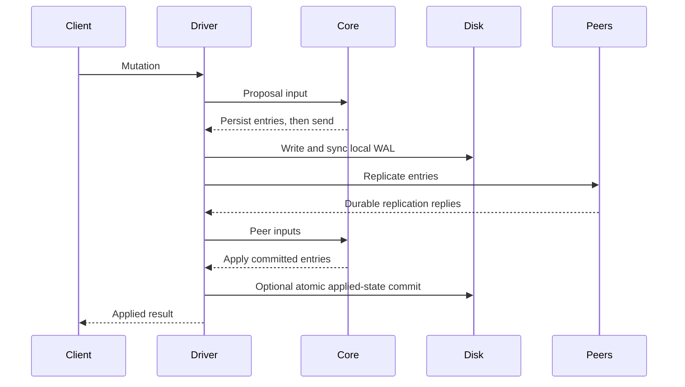

# Architecture and invariants

The central interface is a deterministic transition: `RaftNode::step(Input)`
returns an ordered list of `Effect`s. The core owns terms, votes, replication
progress, configuration and commit decisions. The runtime owns sockets, clocks,
filesystem operations, application state and response waiters. The simulator
executes the same core with virtual time, links and disks.

This separation makes ordering testable. Returning a persistence effect does not
mean it has reached stable storage. The driver must finish it before executing
dependent sends, application publication or successful responses. A persistence
error stops the writer; continuing after an unknown partial write could violate
the core's assumptions about the disk.

## Commitment and application

Replication, commitment and application are separate positions. A follower can
store an entry that a later leader replaces. A committed prefix must survive
leader changes. Application means the state machine has actually processed that
prefix and, in persistent application modes, the engine has completed its atomic
transaction.

A leader advances commitment using a quorum and an entry from its current term.
Counting replicas of an older-term entry alone is insufficient: a future leader
can have a different older prefix while still satisfying the election log test.
Committing a current-term entry establishes the safe prefix that includes earlier
entries. The election no-op supplies such an entry even when clients are idle.

The single writer applies entries in order. Adjacent application effects may
share an engine transaction, but each request keeps its own response and original
log index. An undo journal and application write lock keep provisional values
invisible until the durable range succeeds. This is distinct from proposal
batching, which groups WAL appends before consensus has committed them.

## Checked reads and ambiguous writes

A local read reports the node's current cache and applied boundary. It can be
stale, including on a former leader that has not yet detected a partition.

A checked read requires a committed current-term entry, fresh quorum replies
correlated with its read context, and an application watermark at least as high
as the confirmed index. An old heartbeat response cannot satisfy a new read.
Neither a leader role label nor the core's scheduled apply position proves that
the application has reached this boundary. PreVote and CheckQuorum improve
election behavior; they do not establish a time-based read lease.

A lost write response is ambiguous. The entry may still commit after the client
times out, or the request may have expired before admission. Retrying an ordinary
PUT can therefore become a second operation. Replicated sessions retain a
key-scoped sequence, payload and original response. An identical latest retry
returns that response, even if an independent later write changed the value.
The retained table is bounded and never silently evicts old identities. Capacity
refusal is explicit; it is not a promise of unlimited exactly-once execution.

## Snapshots and two durable representations

A snapshot replaces an applied log prefix with a validated application image and
configuration boundary. A checksummed `CURRENT` selects the snapshot and retained
WAL together. New files and directory entries become durable before selection;
only a validated selected generation permits reclamation. Recovery cannot choose
an older image merely because the selected one is corrupt.

LSM and redb application stores are derived representations of the consensus
state. They atomically store values, session metadata and the applied index/term.
On reopen, deterministic replay of the selected snapshot and WAL must agree with
the engine through its watermark. This check prevents a plausible index from
masking missing values or retry records. A snapshot publication interrupted before
the engine install can repair the older engine from the selected newer image.

The LSM uses immutable sorted tables, Bloom filters, a merge iterator, tombstones
and bounded leveled compaction. Its WAL verifies the fixed header's checksum
before trusting a payload length, so a corrupted length cannot disguise a
complete acknowledged frame as a recoverable torn tail. Compaction includes
overlap across the full selected key span, including gaps, before publishing the
replacement manifest. Tombstones remain while an unselected run might contain
an older value.

The service retains a complete application cache in memory. Its HTTP read path
therefore does not measure LSM table or Bloom performance. The engine worker and
the replicated service have separate workload protocols and results.

## Replica membership

A group's identity and genesis voters are immutable. Peer addresses tell a node
where to send traffic; they do not give a reachable process a vote. A newly
started process outside genesis stays passive until a replicated learner
admission and catch-up. Promotion changes voting authority through two logged
configurations: joint old-and-new, then final new-only.

The newest durable logged configuration controls elections, commitment,
CheckQuorum and checked reads. While joint is effective, a decision needs a
majority of each voter set. Counting a majority of their union would be unsafe:
the counted nodes might satisfy only one side. The final configuration can be
appended only after the joint entry commits, and then uses the new majority.
An excluded leader may replicate that final entry without counting itself; it
steps down after commitment.

Effective authority and administrative completion are deliberately separate.
An uncommitted configuration already changes quorum rules, but an administrative
200 response requires the exact retained result to be committed and applied.
After a lost response, retry the same request ID and operation. The retained
history prevents a retry from becoming a different configuration change.
Retired replica IDs cannot be reused, and reaching a retention bound produces
an explicit refusal.

Recovery combines the selected snapshot, retained log and hard-state membership
watermark. It checks exact history extensions before serving. A group-bound
advertisement can supply a reply address to a stale replica, but cannot certify
commitment or replace its durable configuration. The protocol assumes trusted
peers subject to crashes and network faults; it supplies no Byzantine proof.

## Shard ownership and handoff

The shard service runs a controller group and independent data groups. A route
contains a shard, owner and epoch. Moving a shard changes its owner; membership
changes the replicas inside one group. Neither operation supplies cross-shard
transactions.

A replicated controller maintenance ticket serializes membership changes with
handoffs across all groups. Acquisition compares a checked controller generation;
the target derives its administrative request ID from the ticket's log origin.
Only the exact committed and applied target result can release that ticket.
Neither a timeout nor an absent local record cancels it: restore the target's
quorum and retry the same request. An unfinished handoff, including abort cleanup,
prevents ticket acquisition, and a held ticket prevents a new handoff. Ordinary
data operations can continue while membership maintenance is active.

A handoff first fences the source. The source then rejects old-route reads and
writes and exposes a stable transfer image containing values, deletion markers,
sessions and retry receipts. The destination pulls and validates bounded chunks.
The controller changes ownership only after installation, and the destination
serves the new epoch only after activation. Source cleanup requires checked
evidence of destination activation, so an intermediate crash cannot discard the
last valid copy.

Retry receipts preserve their original group and log index after movement. The
destination's installation entry is not the index of an earlier client write.
Preserving that distinction lets an exact retry return its original response
while later independent writes retain their own history.

Before ownership changes, a replicated abort can restore the source and discard
the incomplete destination. Abort and ownership commitment are mutually
exclusive. Both endpoint cleanup receipts are required before another move
involving either endpoint;
retained transfer tombstones reject delayed messages from the abandoned move.
After ownership changes, recovery proceeds forward through activation and
cleanup. The state machines reserve enough bounded metadata space for those
required transitions rather than allowing unrelated writes to consume it.

Placement experiments are separate from handoff. A consistent-hash ring can
reduce the fraction reassigned after a group change while producing worse load
imbalance in a particular finite shard set. The published placement report
measures assignments and synthetic demand; live process tests exercise actual
state transfer and recovery.

## Bounds and failure interpretation

Bounded queues, proposal batches, frames, snapshot images and transfer slots
control specific operations. They do not establish a total resource quota: a
refused oversized snapshot retains the WAL, and synchronous filesystem calls
cannot be interrupted by a logical shutdown deadline.

Tests distinguish a rejected request, an acknowledged result and an unknown
outcome. A fault experiment must confirm that the intended fault actually took
effect, record every attempted operation, and account for cleanup. A missing
operation, unqualified replacement leader or incomplete observation is not a
successful run. Process crashes and filesystem barriers also differ from a
physical device losing power.

See the [rule index](raft-rules.md), [client contract](client-semantics.md),
[snapshot protocol](snapshots.md), [batching](proposal-batching.md) and
[applied-state recovery](applied-state.md) for the exact interfaces and limits.
